# SERF-tmp_l3_recursive.pni_recursive

Nico ma ti torna questa ricostruzione? Mi sembra molto strano.

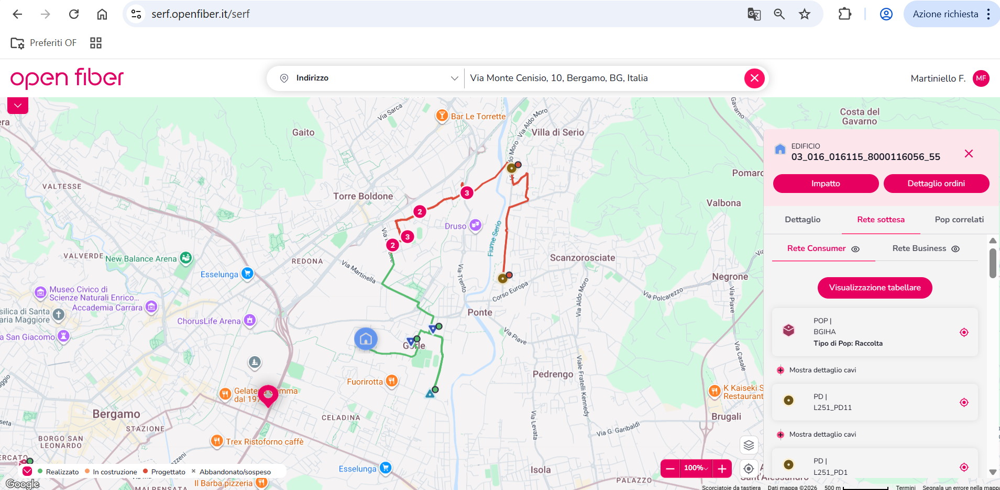


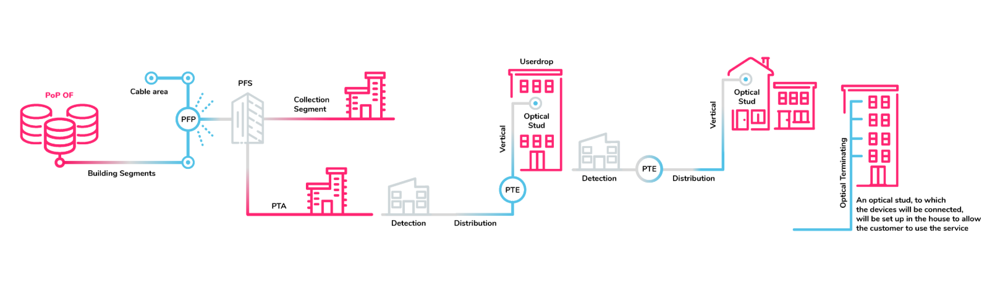


# Fiber Network Architecture – Key Concepts (Open Fiber)

This document explains some fundamental concepts used in **FTTH (Fiber To The Home)** networks, particularly those used by companies such as Open Fiber in Italy.

---

# 1. What is FTTH?

**FTTH (Fiber To The Home)** is a broadband network architecture where **optical fiber cables run directly from the provider’s infrastructure to the user's home**.

Compared to copper networks, FTTH provides:

* Higher bandwidth
* Lower latency
* Better reliability
* Future scalability

FTTH is widely used to support modern services such as:

* Ultra-HD video streaming
* Cloud services
* Online gaming
* Internet of Things (IoT)
* 5G mobile backhaul

---

# 2. PON Technology

Most FTTH networks use **PON (Passive Optical Network)** technology.

PON allows a **single optical fiber from the provider to be shared by multiple users**.

This architecture is called:

**Point-to-Multipoint**

Instead of providing a dedicated fiber to every user, the signal is split using passive devices.

### How it works

Provider Central Office
↓
Fiber Cable
↓
Optical Splitter
↓
Multiple Homes

The splitter divides the optical signal to serve many customers.

---

# 3. Evolution of PON Technologies

PON technology continues to evolve to provide higher speeds.

| Technology | Download Speed | Upload Speed  |
| ---------- | -------------- | ------------- |
| GPON       | 2.5 Gbps       | 1.25 Gbps     |
| XG-PON     | 10 Gbps        | 2.5 Gbps      |
| XGS-PON    | 10 Gbps        | 10 Gbps       |
| NG-PON2    | up to 40 Gbps  | multi-channel |

This evolution allows networks to support increasing bandwidth demands.

---

# 4. PON vs AON

Two main fiber network architectures exist.

## Passive Optical Network (PON)

Characteristics:

* Point-to-Multipoint
* Uses passive components (splitters)
* No electrical power required along the path
* Lower deployment cost
* Lower failure probability

This is the architecture used by many providers.

---

## Active Optical Network (AON)

Characteristics:

* Point-to-Point architecture
* Each user has a dedicated fiber
* Requires active equipment (switches, routers)
* Requires electrical power along the network
* Higher deployment cost

Although AON offers dedicated connections, it is more expensive to deploy.

---

# 5. Apparato Edificio (Building Equipment)

**Apparato Edificio** refers to the **fiber distribution equipment installed inside a building**.

Its purpose is to **connect the building's apartments to the fiber network coming from the street**.

### Typical location

The equipment is usually installed in:

* Building entrance
* Technical room
* Electrical room
* Basement

### Function

The Apparato Edificio distributes the incoming fiber to each apartment.

Network flow example:

Street Fiber Network
↓
Building Equipment (Apparato Edificio)
↓
Fiber cable to each apartment
↓
Router / ONT inside the home

### Components typically inside

The building equipment may contain:

* Optical splitter
* Fiber connectors
* Patch panel
* Distribution ports for apartments

For example:

If a building has **10 apartments**, a fiber connection arrives from the street and is distributed to all apartments through this device.

---

# 6. Common FTTH Network Elements

Several components are commonly used in FTTH infrastructures.

| Component | Description                          |
| --------- | ------------------------------------ |
| POP       | Point of Presence – main network hub |
| PFS       | Street distribution node             |
| PTE       | Building fiber distribution box      |
| PTO       | Optical outlet inside the apartment  |

These elements create the path from the operator’s network to the final user.

---

# 7. Transport Network

Once data enters the operator's network, it is transported through a national infrastructure composed of two main layers.

### Core Network (Backbone)

* Connects major cities
* High-capacity optical links
* Supports large volumes of traffic

### Aggregation Network

* Collects traffic from access networks
* Connects local areas to the backbone

---

# 8. Optical Transport Technologies

Modern fiber networks use technologies such as:

**DWDM (Dense Wavelength Division Multiplexing)**

This allows multiple optical signals to travel on the same fiber using different wavelengths.

Benefits:

* Massive capacity
* Efficient fiber utilization
* Terabit-scale transmission

A single fiber can carry hundreds of gigabits per second.

---

# 9. Future Applications

High-capacity fiber networks enable future digital services including:

* 8K video streaming
* Virtual Reality (VR)
* Augmented Reality (AR)
* Cloud gaming
* Autonomous vehicles
* Smart cities
* Internet of Things (IoT)

---

# Conclusion

FTTH networks represent the future of broadband connectivity.

Using technologies like **PON**, operators can deliver high-speed internet to millions of users efficiently and at lower cost.

Infrastructure elements such as **Apparato Edificio** play a crucial role in distributing fiber connections within residential buildings, ensuring that each apartment can access ultra-broadband services.


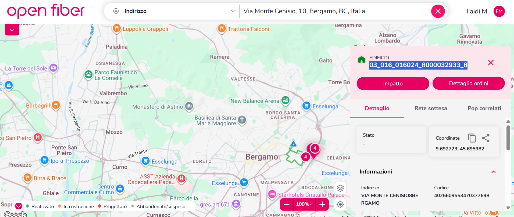

03_016_016024_8000032933_8

APPARATO EDIFICIO :4026609553665681626

because Scala a lot of number select : select filter Commune : Bergamo QLIK -> NETWORK CREATION STREAM -> DASHBOARD CIVILE NORD-OVEST BECUAE BERGAMO THERE

Down there are a lot of columns. We need to focus and go inside the sheet column SCALA SHEET and make zoom on the map so the value of the SCALA SHEET column shows


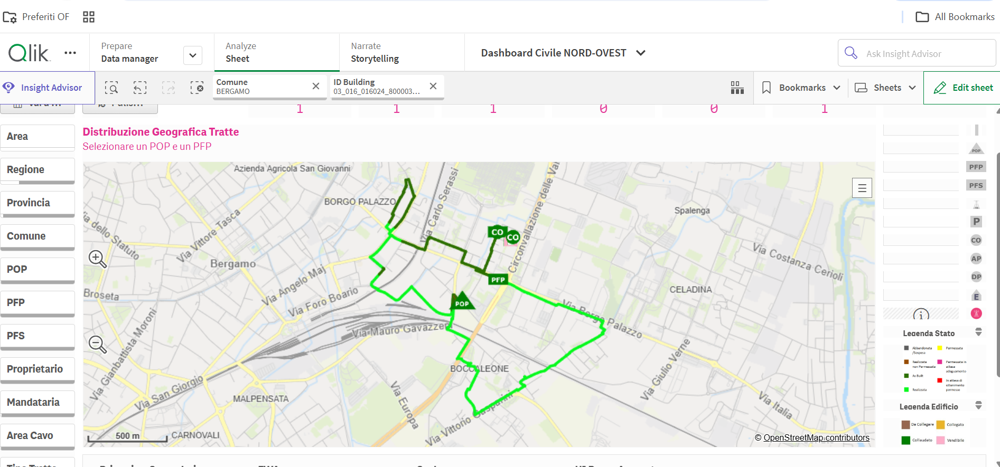
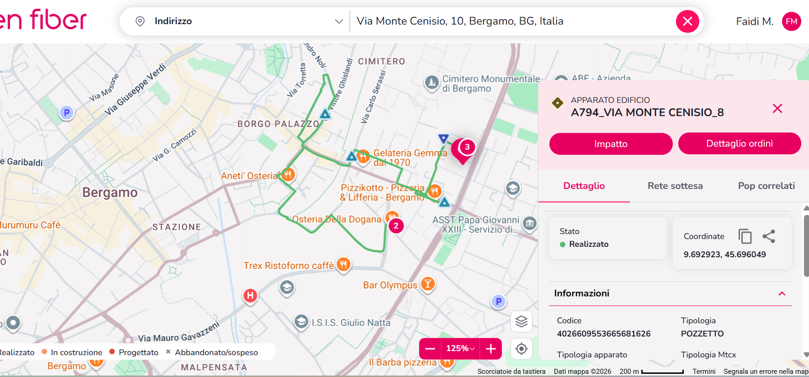


APPARATO EDIFICIO :4026609553665681626

SELECT * FROM tmp_l3_recursive.pni_recursive where id = xxxx --PATH_id LIKE '%3212379411477711925%' LIMIT 100 ;

SELECT id,path_id FROM tmp_l3_recursive.pni_recursive WHERE id = '4026609553665681626';

instead of xxxx try to use the code of apparato edificio you will see the list of cable from apparato edificio to pop this is an usefull table to check the continuity of the net what he means


## What Result You Will Get

The statement:

> "you will see the list of cable from apparato edificio to pop"

means that the query returns:

**All the cables forming the path from the building device (Apparato Edificio) to the POP (Point of Presence).**

---

##  Network Path Representation

The result typically represents the network path as follows:

```
Apparato Edificio
        ↓
Distribution Cable
        ↓
Joint / Cabinet
        ↓
Backbone Cable
        ↓
POP
```

---

## What is Apparato Edificio

**Apparato Edificio** refers to:

> The fiber device or termination point located inside a building that connects the building to the fiber network.

In simple terms:

* It is the **fiber entry/distribution point inside the building**
* It represents the **starting node of the network path**

Example:

```
AE ID: 4026609553665681626
```

---

##  What the Query Shows

When running the query, it displays:

* The list of cables
* The sequence of network elements
* The full path from:

  * Apparato Edificio → POP

---

##  What is POP

**POP (Point of Presence)** is:

> The central node of the network where fiber connections are aggregated.

It acts as:

* A **core network hub**
* The **final destination of the fiber path**

---

## Why This Table is Useful

The statement:

> "this is a useful table to check the continuity of the net"

means that this table is used to verify:

### ✅ Network Continuity

It helps ensure that:

* All cables are properly connected
* No segment of the path is missing
* The fiber connection is complete from building to POP

### 🔍 Detect Issues Such As:

* Missing cables
* Broken connections
* Incorrect routing
* Incomplete topology

---

## Explanation of Output Columns

### 1. id

```
4026609553665681626
```

* This is the **Apparato Edificio ID**
* It represents the starting point of the path

---

### 2. level

```
9
```

* Indicates the number of nodes in the path
* The path includes approximately **9 network elements**

---

### 3. isroot

```
FALSE
```

* This node is **not the root** of the tree structure in the database

---

### 4. isleaf

```
TRUE
```

* This is the **end of the path**
* The path terminates at the **POP**

---

### 5. iscyclic

```
FALSE
```

* There is **no loop** in the network path
* This is correct and expected behavior

---

### 6. isfork

```
FALSE
```

* There is **no branching (fork)** in this path
* The path is linear

---

## 🔑 Most Important Columns

### 7. path_des

```
/APPARATO_EDIFICIO/PD/PFS/PFP/PFP/PFP/PFP/POP
```

This describes the **types of nodes in the path**.

### Path Breakdown:

```
APPARATO_EDIFICIO
        ↓
PD
        ↓
PFS
        ↓
PFP
        ↓
PFP
        ↓
PFP
        ↓
PFP
        ↓
POP
```

### Element Meanings:

| Element           | Meaning                      |
| ----------------- | ---------------------------- |
| APPARATO_EDIFICIO | Building fiber device        |
| PD                | Distribution Point           |
| PFS               | Secondary distribution point |
| PFP               | Primary distribution point   |
| POP               | Central network node         |

---

### 8. path_cavo

* Contains the **IDs of the cables**
* Represents the physical connections between nodes

---

### 9. path_id

* Contains the **IDs of the network elements (nodes)**
* Represents the devices or connection points

---

## 8️⃣ Why There Are Two Rows

If the query returns two rows, it means:

### 🔁 There are Two Different Paths to the POP

Example:

* Route 1: Apparato Edificio → PD → ... → POP
* Route 2: Apparato Edificio → PD → ... → POP

### ✅ This is Normal

Fiber networks often include:

* **Redundant paths**
* **Alternative routes**

This improves:

* Reliability
* Fault tolerance

---

## ✅ Final Summary

* The query shows the **full fiber path from the building to the POP**
* It includes:

  * Nodes (devices)
  * Cables
* It is used to:

  * Verify network continuity
  * Detect errors in topology
* A valid result should have:

  * No loops (`iscyclic = FALSE`)
  * A complete path ending at POP (`isleaf = TRUE`)

---

🚀 This table is essential for validating fiber network integrity and ensuring correct connectivity from end-user buildings to the core network.


# Open Fiber Network FAQ / Notes

This document summarizes key concepts about network elements and length calculation in the Open Fiber network, as well as notes on potential visualization issues.

---

## 1. Network Length Calculation

**Question:**  
When calculating the network length, should it be measured from the user’s home to the POP, or from the Building Apparatus to the POP?

**Answer:**  
- The network created in the **Creation process** reaches up to the **Building Apparatus**, which may sometimes be located inside the building (e.g., PTE – Punto Terminazione Edificio).  
- During **Delivery** (i.e., order activation), the network is extended from the **Building Apparatus** to the customer’s home to provide the optical fiber connection.  
- Therefore, network length is generally considered **from the Building Apparatus to the POP**, while the segment from the building to the customer is handled separately during delivery.

---

## 2. Building Apparatus Location

**Question:**  
Is the Building Apparatus located inside or outside the building?

**Answer:**  
- **Inside the building:** Type **PTE** (Punto Terminazione Edificio).  
- **Outside the building:** Type **PTA** (Punto Terminazione Arretrato). PTA can be:  
  - **Aerial** – e.g., installed on the façade of the building.  
  - **Underground** – e.g., in a manhole.

---

## 3. Circular Paths / Loops in Qlik

**Question:**  
In Qlik, a **circular path (loop)** appears in the network, while the database shows `iscyclic = false`. Could this be a visualization issue or data from different models?

**Answer:**  
- Verify the network at points where it **branches** (bifurcations).  
- Check if **two different network paths** originate from the same point in the **recursive table**.  
- Sometimes loops in Qlik are **only a visualization effect** and do not correspond to actual cycles in the data.

---

## 4. POP to PFP Paths

**Note:**  
- There may be unusual paths from **POP to PFP**.  
- These should be carefully checked in the data model to confirm whether they represent true network routes or visualization artifacts.

---

This README is intended to clarify how network elements are represented, how lengths are calculated, and how to interpret potential loops in visualization tools like Qlik.


#ITALIANO : 
# Rete Open Fiber – Apparato Edificio e Lunghezza della Rete

Questo documento spiega gli aspetti principali relativi all'**Apparato Edificio** nella rete di Open Fiber, come calcolare la lunghezza della rete e alcune note su possibili percorsi circolari nella visualizzazione.

---

## 1. Posizione dell'Apparato Edificio

**Domanda:**  
L’Apparato Edificio nella rete di Open Fiber si trova all’interno dell’edificio oppure all’esterno?

**Risposta:**  
- **All'interno dell'edificio:** Tipo **PTE** (Punto Terminazione Edificio).  
- **All'esterno dell'edificio:** Tipo **PTA** (Punto Terminazione Arretrato), che può essere:  
  - **Aereo** – ad esempio sulla facciata del palazzo.  
  - **Interrato** – ad esempio in un pozzetto.

---

## 2. Calcolo della Lunghezza della Rete

**Domanda:**  
Quando calcoliamo la lunghezza della rete, dobbiamo considerarla dalla casa dell’utente fino al POP, oppure dall’Apparato Edificio fino al POP?

**Risposta:**  
- La rete creata nel processo di **Creation** arriva fino all'**Apparato Edificio**, che a volte è situato all'interno dell'edificio (es.: PTE).  
- Durante la fase di **Delivery** (ovvero l'espletamento di un ordine di attivazione), la rete viene progettata e realizzata dall'**Apparato Edificio** fino dentro la casa del cliente che ha richiesto la fibra ottica.  
- Pertanto, la lunghezza della rete è generalmente considerata **dall'Apparato Edificio fino al POP**, mentre il segmento dall'edificio al cliente è gestito separatamente in fase di delivery.

---

## 3. Percorsi Circolari / Loop in Qlik

**Osservazione:**  
In Qlik sembra esserci un **percorso circolare (loop)** nella rete, mentre nel database il campo `iscyclic = false`.

**Note:**  
- Potrebbe essere **solo un effetto di visualizzazione** sulla mappa.  
- Potrebbe anche dipendere dal fatto che i dati provengono da **modelli diversi**.  
- È consigliato verificare se, sul punto in cui la rete si biforca, ci sono **due percorsi di rete diversi** nella **tabella recursive**.


SELECT id,
       path_id
FROM tmp_l3_recursive.pni_recursive
WHERE id = '4026609553665681626';


SELECT id,
       path_id,
       path_des
FROM tmp_l3_recursive.pni_recursive
WHERE id = '4026609553665681626';

#EXTRACT ID FROM DES_ID 
-- 6622851106802910794 questo quardo
-- 6622851106814994316 questo 5 prima row
-- 4026609553343146678 questo 5 secondo row


SELECT *
FROM l3_qlik.pni_dm_pfp_ad
WHERE cod_pfp_ad in (6622851106802910794,
                     6622851106814994316,
                     4026609553343146678);


des_nome_pfp_ad:

BG_02/01E3

BG_02/01W4

BG_02/01E4

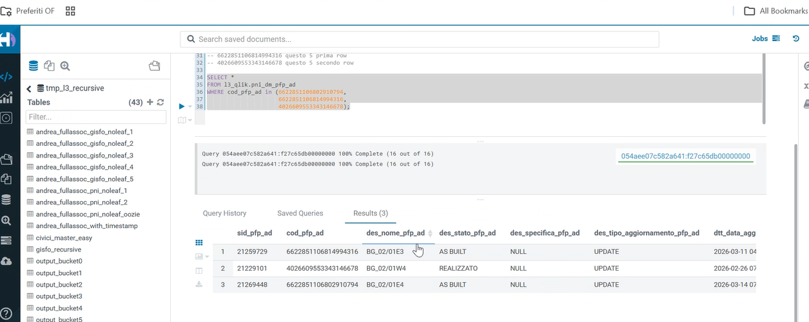

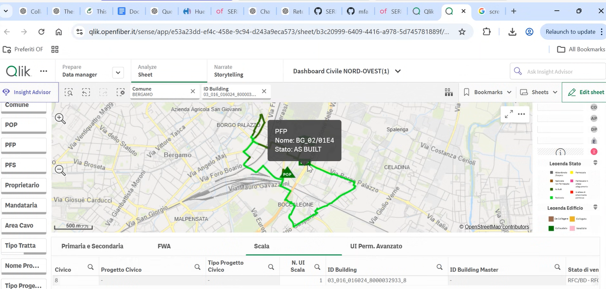


#MISSING (BG_02/01E1,BG_02/01E2)

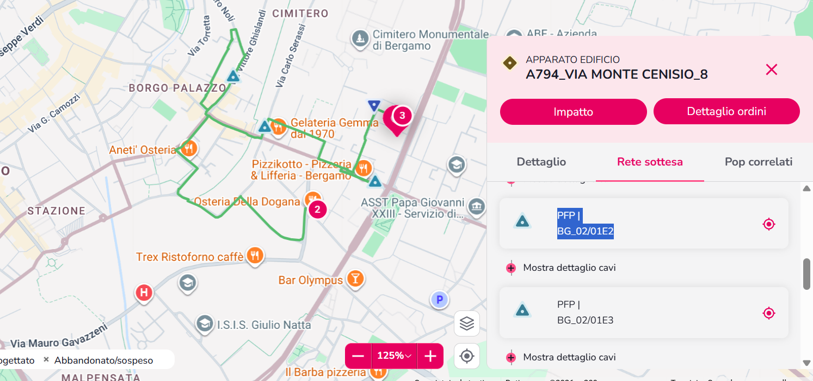


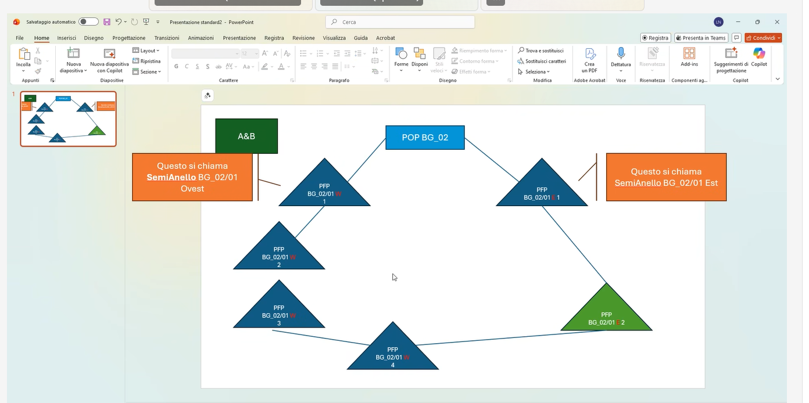
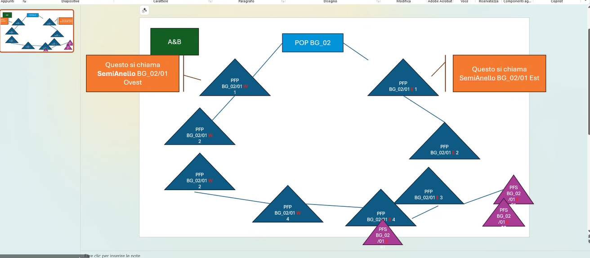

# Open Fiber Meeting – Full Conversation Translation and Explanation

I will translate the conversation completely in a clear way because the original text contains repetition and errors from the voice transcription.
I will write it as a **clear dialogue in English** so the discussion in the meeting can be understood.

---

# Conversation Translation

**Nico Laruina (Open Fiber):**
And does this also apply to **AEB**?

**Carine:**
Okay.

**Mohammad Faidi:**
Okay.

---

**Nico:**
Why?

To answer your question Mohammad, why does the **network path in this PFP look strange?**

Because here we are **not moving in a Ring or Semi-Ring structure**.

---

**Nico:**
Okay, because what happens here is that when we reach **point number 4**...

We have **3 and 4**.

Wait a moment, let me see if I explain it correctly.

When we reach **point 4**, what happens?

I start **connecting the segments together**.

---

**Nico:**
So I do it like this:

I am on **AB**.

I create a **Ring**.

And the **PFP is divided into a Semi-Ring**.

Why is it called **Semi-Ring**?

Because there is **a full ring but split into two halves**.

---

## Nico explains the structure

The **POP** is located in the center.

Then we have:

* **West side**
* **East side**

And these two parts **eventually reconnect to form a complete ring**.

---

**Nico:**
After that, in this section the **PFS units connect**.

So here we will have:

* **PFS1**
* **PFS2**
* **PFS3**
* **PFS4**

---

**Nico:**
Meaning that from the **PFP**
I connect to the **PFS**.

So we will have:

* **PFS1**
* then **PFS2**
* until **PFS4**

Is that clear?

Do you have any questions?

---

**Carine:**
But Nico, why does **number 4 not connect directly**, and instead goes to **3 first**?

---

**Nico:**
Because each one has **its own PFS group**.

---

**Carine:**
Ah, I understand.

---

**Nico:**
So this one will have **its own PFS**
and the other will have **another PFS group**.

But here what will happen?

Instead of being **3**,
it will be **4 and 1**.

---

## Nico asks Mohammad

**Nico:**
What is the strange thing about this path, Mohammad?

Why don’t I go **directly in a ring like this**?

---

**Mohammad Faidi:**
Nothing.

---

**Nico:**
But **PFS2 is connected**.

It is already connected.

---

## Nico explains the problem

What actually happens is that:

**This connection does not exist here.**

Right?

So I connect **2 with 4**.

---

**Nico:**
And this is supposed to be **your PFS**.

---

**Carine:**
Yes, that is the one.

---

**Nico:**
This is the one you see in **Click (Qlik)**.

Then after that:

* one branch goes **to the right**
* another branch goes **to the left**

Right?

---

**Nico:**
So the reason is that **AEB is designed this way**.

---

**Carine:**
Nico please, can you correct **PFP22 to 1123**
so I can take a **screenshot**?

---

**Nico:**
Ah, I need to **rearrange it**.

---

**Carine:**
Yes, just correct the **West part**
the numbers **1-2-3-4**.

Especially **number 3**.

---

**Nico:**
Okay.

---

**Carine:**
So that I can take a **screenshot**.

---

**Mohammad:**
For me it was **good, Carine**.

---

**Carine:**
Yes yes, I will **send it to you**.

---

**Nico:**
Ah, do I need to go to another **meeting now**?

---

**Carine:**
Wait a moment.

---

**Carine:**
Mohammad, take a **screenshot of that Query**.

---

**Mohammad:**
Okay, thank you very much.

---

**Carine:**
Yes, like that it’s good.

---

**Nico:**
If we go back we can also **do this**.

---

**Carine:**
Okay.

---

**Nico:**
Like this for example?

---

**Mohammad:**
Yes, like that is good too.

---

**Nico:**
Okay, take the **picture from here**.

---

# Technical Summary of the Meeting

They were discussing the **Open Fiber network structure**.

## Basic Network Structure

```
POP
 |
PFP
 |
PFS1
PFS2
PFS3
PFS4
```

---

## Real Network Design (Ring / Semi-Ring)

```
        PFS2
       /     \
POP — PFP     PFS3
       \     /
        PFS4
```

---

## Main Idea

* **POP** is located in the center.
* The network splits into **East / West directions**.
* At the end the two sides reconnect to form a **Ring topology**.

However, sometimes the **path in the data appears non-circular** because of the way the connection between **PFS2 and PFS4** is represented.

---

If you want, I can also explain **exactly why a Loop appeared in your Query in Qlik or SQL**,
which is very important for your work with **Open Fiber**.


# Via Monte Cenisio, 10, Bergamo, BG, Italia === 03_016_016024_8000032933_8


# perché la rete dell'id building su Dashboard Civile disegna un anello e non segue lo stesso percorso visibile su Serf

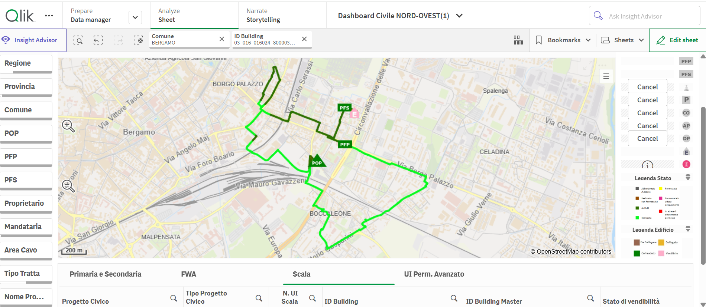
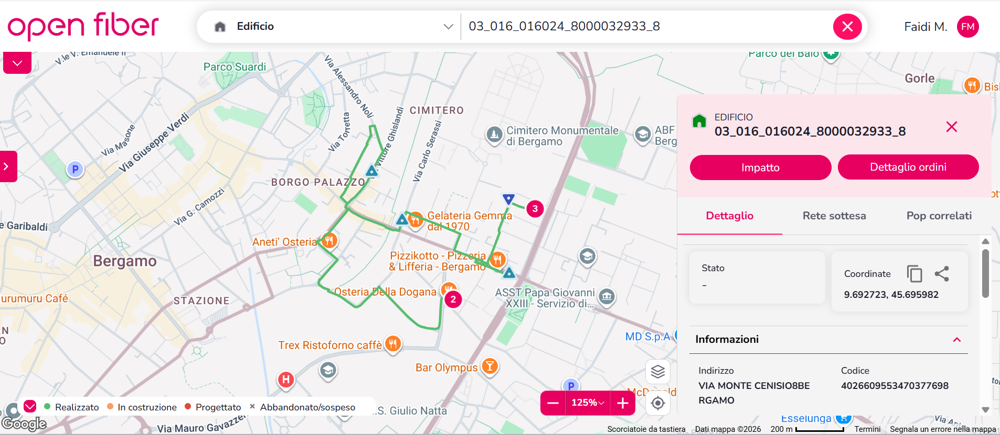


**Nella Dashboard la rete appare come un anello, il che può indicare la presenza di percorsi multipli o connessioni incoerenti, mentre SERF mostra solo il percorso principale.**

**Skip connection (ad esempio PFP2 → PFP4)
 può causare un loop fittizio**

**lo stesso cavo è duplicato**

**Bypass nella realtà
 stato bypassato un nodo (ad esempio PFP3), quindi ci sono due percorsi**
